# 🏓 PingPong Online

> 🎮 C# WinForms 기반 TCP/IP 온라인 멀티 핑퐁 게임
 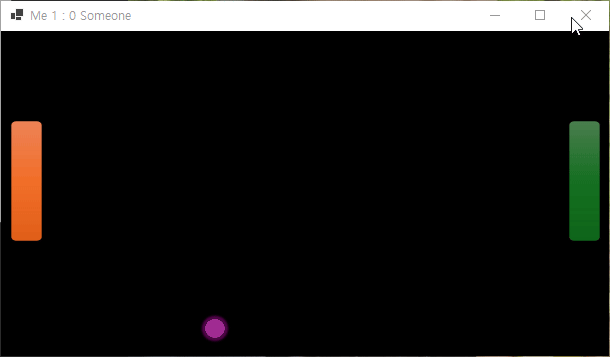

 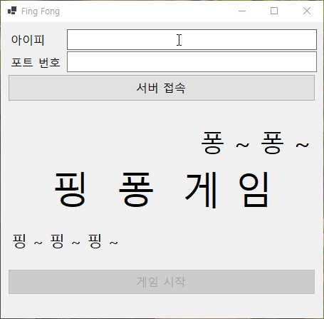

 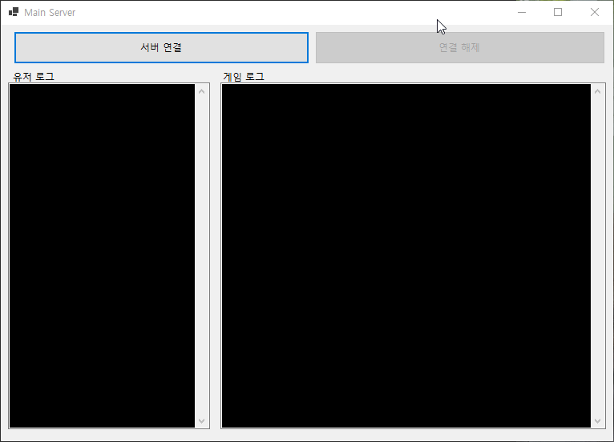

 

---

## 📘 프로젝트 개요

`PingPong Online`은 TCP/IP 기반 네트워크 프로그래밍을 통해 **서버-클라이언트 구조 설계** 및  
**실시간 데이터 송수신, 멀티 클라이언트 매칭, 비동기 통신 구조**를 직접 구현한 온라인 핑퐁 게임입니다.  
실제 서비스 환경에서 동작 가능한 네트워크 구조를 목표로 개발되었습니다.

 

- **인원**: 1명
- **진행 기간**: 2025/10/23 ~ 2025/10/27  
- **장소**: 광주인력개발원 공학 1관 드론융합실  

 

본 프로젝트는 **광주인력개발원** 훈련 과정 팀 프로젝트로 진행되었습니다.

 

---

## ⚙️ 개발 환경

| 항목 | 내용 |
|------|------|
| 🖥 OS | Windows 10 |
| 💻 언어 | C# (.NET 8.0) |
| 🧩 IDE | Visual Studio 2022 |
| 🪟 프레임워크 | WinForms |
| 🌐 네트워크 방식 | TCP/IP Socket (비동기 통신) |

 

---

## 🕹 주요 기능

| 구분 | 기능 설명 |
|------|------------|
| 🧠 서버 | 클라이언트 연결 관리, 매칭 처리, 게임 세션 관리 |
| 🎮 클라이언트 | 서버 접속, 매칭 요청, 게임 플레이 및 결과 수신 |
| 🔁 실시간 통신 | 좌표, 점수, 상태 메시지 실시간 송수신 |
| 🚨 예외 처리 | 연결 끊김, 포기, 서버 다운 등의 예외 대응 |
| 📜 로그 관리 | 서버 이벤트 및 게임 결과 로그 출력 |

 

---

## 🧱 주요 화면

### 🖥 서버
| 구분 | 설명 |
|------|------|
| 서버 시작 |  |
| 연결 대기 | 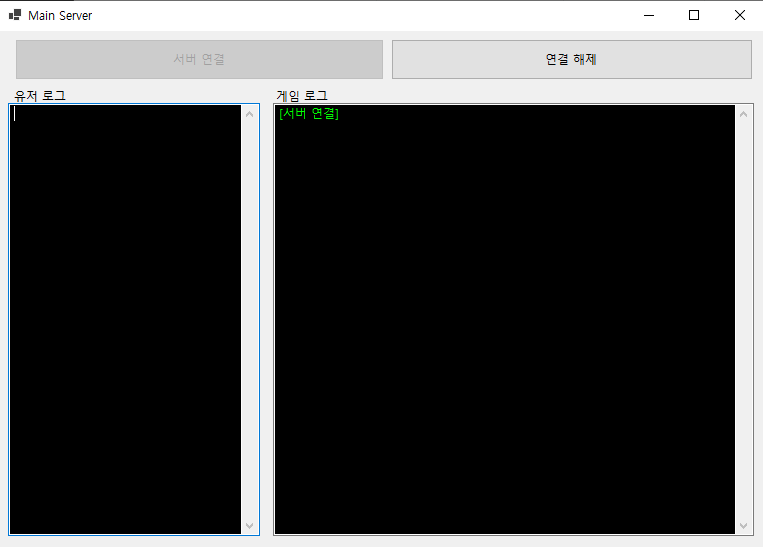 |
| 로그 출력 | 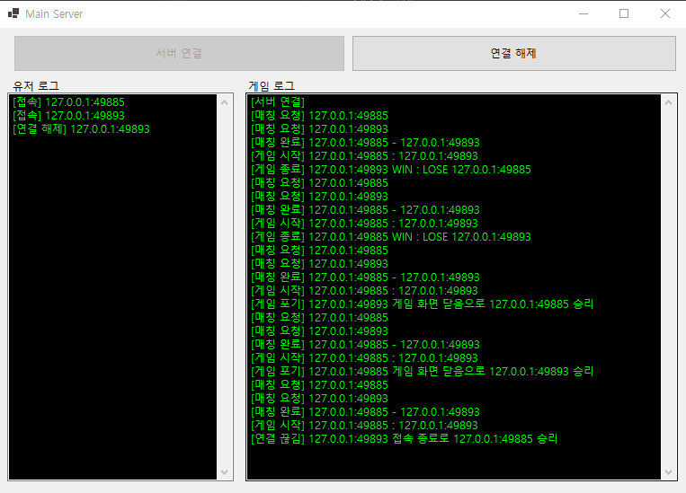 |

 

### 💻 클라이언트
| 구분 | 설명 |
|------|------|
| 클라이언트 시작 | 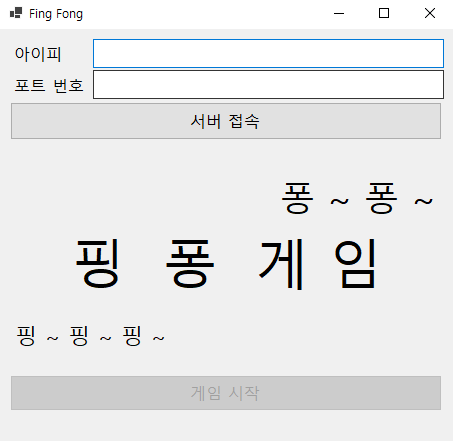 |
| 서버 연결 성공 | 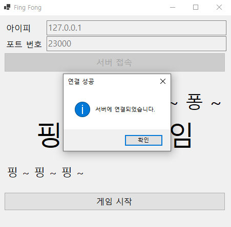 |
| 서버 연결 실패 | 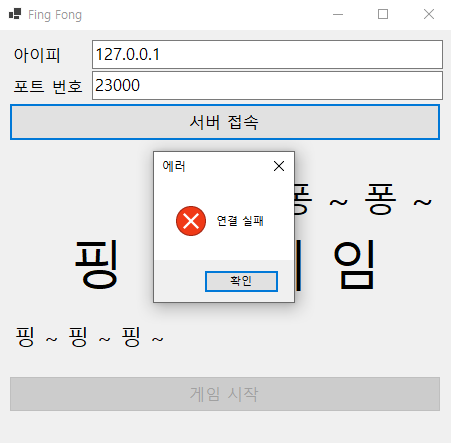 |
| 게임 대기 | 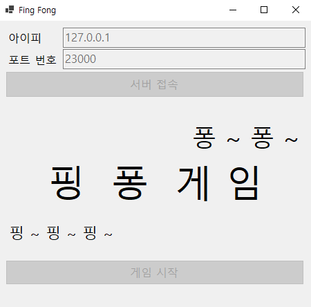 |
| 게임 시작 | 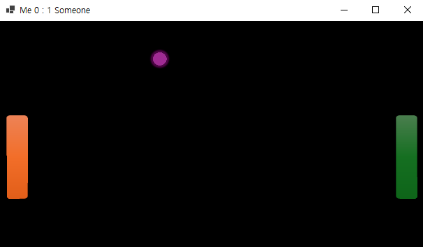 |
| 승리 화면 | 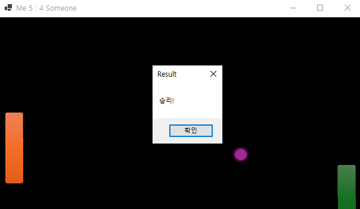 |
| 패배 화면 | 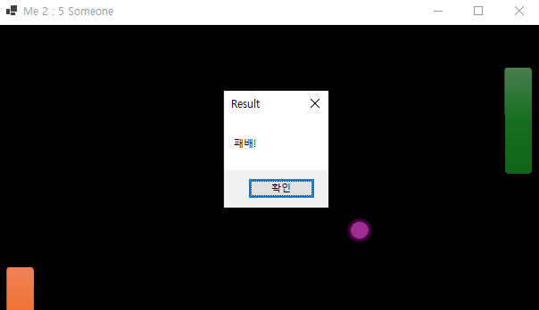 |

